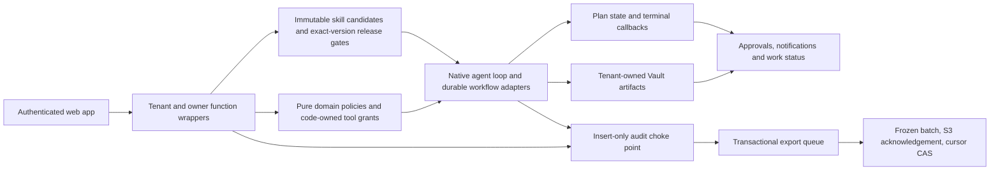

# Merged audit versus current code — 2026-09-10

Current continuation: [September 12 production acceptance](2026-09-12-production-acceptance.md)
records the later repairs and exact release evidence. The current verified production baseline is
`93d905d5ae652d6996ed3f0080b968da6f8f156a`; CI
[34756673585](https://github.com/Mrjoel97/ProjectX/actions/runs/34756673585) and production deployment
[34756978362](https://github.com/Mrjoel97/ProjectX/actions/runs/34756978362) succeeded for that exact
commit. It includes Phase 31's approved navigation and direct live desktop/mobile/file/lead
acceptance, the Phase 23 authentication-only readiness repair, and the deployed Stage 1/2
[research request controls](2026-09-12-research-request-controls.md). Native bounded authoring
probes and exact vertical-corpus preflight are deployed; the authorized Phase 23 probe, remaining
Phase 23/30 semantic/lifecycle/provider evidence, research-control live acceptance and Stage 3
deliverable dependency are still open.
The findings and qualification below retain their September 10 scope;
their statements that no deployment occurred and Phase 31 was unimplemented are historical.

Baseline: `3caa762` plus the working-tree repairs documented below. Authority: [System Audit rev 5](../design/system-audit-2026-09-03-merged.md), its merged build order in §5, and owner decisions in §6. Four parallel investigations examined reliability, product flows, release evidence and remaining phases. Source files and executable checks take precedence over retrospective completion prose.

## Findings that change the implementation plan

The system already has the proposed modular architecture: pure TypeScript domain packages, tenant-scoped Convex adapters, code-owned capability grants, immutable skill candidates, explicit approval, a shared audit spine and durable workflow components. A service split would not repair the defects found here. The durable solution is to complete state transitions, preserve evidence at the boundary where it is observed, and make those facts visible to users.

The merged audit is a historical snapshot, not an accurate current backlog. Phases 34–46 implemented much of its agenda. Its original five-worker target was subsequently changed to **15** by ADR-040; treating the new constant as a regression would undo an explicit decision. Its freeze recommendation was rejected in §6: optional phases remain schedulable. Beta remains **free and invite-only**; billing activation and a legal entity cannot be inferred from the earlier recommendation to charge immediately.

The important defects found in the current tree were:

1. **Audit export could permanently omit rows.** `wormCursor.auditSince` used an exclusive event timestamp and `worm.exportAudit` advanced to the largest timestamp in a limited page. A page boundary inside equal timestamps loses its tail; late/backdated events also defeat timestamp watermarks. Durable repair requires a transactional pending-export record, acknowledgement only after successful upload, deterministic object identity, bounded batches and a migration path for legacy omissions. A creation-time cursor alone does not establish commit order.
2. **Folder digest failure had no durable terminal.** `vaultFolders` scheduled `vaultDigest.buildFolderDigest` while completing the folder, but a missing skill or thrown provider failure could leave no digest and no user-visible result. Use the existing Workflow component with retries disabled on the paid step, explicit synthesis status, idempotent completion and an explicit user retry. Synthesis completion must remain distinct from downstream indexing readiness.
3. **Research presentation overstated its evidence.** Search sources survived as URL/title/retrieval time, while successful `readPage` observations did not survive dispatch and persistence. The footer could imply pages were read even in a snippet-only run. Store a system-observed page-read timestamp only after a nonempty successful extraction; preserve it through fan-out, memo and Vault paths; label legacy and unread sources honestly. This does not establish that a page supports a claim, and the separate unsupported-claim verdict must not silently change.
4. **Background work disappeared across chats.** `approvals.listInFlight` covered only delivery. A bounded shared-shell tray can project specialist preparation, rendering and document processing from existing state, link to its originating chat or Vault, and show truncation explicitly. This is a status projection, not a new job executor or a proof that every worker is healthy.
5. **Reconnect deduplication depended on unrelated notification volume.** `gmailAuth.scanExpiringTokens` searched only the first 50 unread notifications for an existing reconnect warning. A targeted tenant/kind/read index provides an exact existence check without an unbounded scan.
6. **Phase evidence and planning disagreed.** STATE said both “phase 47 in progress” and `status: complete`, and repeated an activation blocker after Phase 44 recorded successful activations. Phase 24 already had the corrective-action chains its pending plan called for. Phase 23 lacked its prescribed offline evidence validator. These are different problems and require different dispositions; none is fixed by ticking every requirement.
7. **Tracing defaults violated the documented content boundary.** The installed Foglamp SDK recorded model inputs/outputs by default and serialized raw errors and provider metadata even with content flags disabled. The shared adapter now disables content capture, sanitizes callback paths that bypass those flags, and replaces provider-authored tool-call ids with local trace references. Seven tests exercise the actual SDK transport with sentinel prompts, image bytes, tool results, provider metadata, ids and errors. Traces retain references, usage and status; normal exceptions still propagate to application callers.

## How the implemented system fits together

The critical boundaries are concrete:

| Boundary | Current mechanism | What it does not prove |
|---|---|---|
| Identity and isolation | `lib/functions.ts` derives tenant/owner context; public adapters validate referenced rows. Vertical previews require the owner before thread writes; ordinary starts independently rerun eligibility. | A frontend hidden button is not authorization. Live two-user acceptance is still required. |
| Instructions and authority | Native skill rows hold immutable versions; provenance, eval and browser evidence gate release. Domain helpers assemble exact tool grants, independent of tier and model prose. | A reviewed prompt cannot grant an absent tool; a registered body is not an activated product. The vertical save-tool integration was tested through the actual shared loop. |
| Paid work and recovery | Existing Workflow orchestration journals bounded work and terminal callbacks. Digest synthesis runs once per workflow; explicit retries start a new attempt. | It does not resume internal computation inside a failed provider call or make arbitrary external writes idempotent. |
| Artifact and outcome truth | Vault writes retain tenant-owned artifacts; successful page reads and deterministic dataset profiles preserve evidence at observation time. Vertical `useful` now requires both grounding and a saved document. | A citation or saved document is not proof of semantic correctness. Model fidelity, useful outcomes and human review remain separate evidence. |
| Operational visibility | Bounded indexed projections expose recorded work and typed audit refs without copying content into status surfaces. | They are neither exact global counts nor worker heartbeats. Bounds can cause conservative omissions that must remain visible. |
| Audit and archive | Audit insertion and queue reference insertion occur in one transaction; upload acknowledgement precedes queue deletion/cursor advance. Frozen batches refuse synthetic cleanup races. | Payload privacy is not guaranteed by `v.any()`. Existing payload checks, retention decisions and real Object Lock receipts still matter; WORM stays off. |

## G1–G26 reconciliation

“Code present” means inspected implementation, not freshly observed production behavior. Historical live evidence applies only to the deployment/version/date it names.

| Gap | Current evidence and status | Durable closure / remaining condition |
|---|---|---|
| G1 terminals and watchdogs | `reliabilitySweep.ts` still arms through `RELIABILITY_SWEEP_ARMED`; it walks media and plan states. `voice.ts` already has its own watchdog. `vaultSweep.ts` already retries stored pending extractions daily. Digest terminal gap repaired in this review. | Observe a production render before arming the destructive sweep; audit the remaining bare chains individually. Do not claim voice and all ingest paths lack recovery. |
| G2 running work | Delivery-only Approvals lane existed; cross-thread shell tray added in this review. | Verify desktop/mobile links and live transitions. Bounded results explicitly disclose partial coverage; no invented exact global count. |
| G3 memo formatting | `MemoCard.tsx` renders markdown and sources. | Preserve source/footer regression tests. |
| G4 research depth | Phase 39 added restricted `readPage`; this review persists successful read observations through `llm.ts`, `dispatch.ts`, `research.ts`, plan/Vault rows and fan-out. | Paid candidate evaluation and real source-quality adjudication remain separate from offline provenance tests. Never label near-miss sources as supporting evidence merely because they were read. |
| G5 document canvas | Phase 40: inline PDF, `vaultSheets`, `SheetGrid`, XLSX generation and ADR-036. | Current signed-in output/download verification, especially legacy/unavailable cases; no need for another canvas architecture. |
| G6 durable specialists | `dispatchRun.ts` journals one paid action with `retry:false`, completion callback and component status lookup. Root/child plans and governed fan-out exist. | This establishes durable orchestration and an honest terminal, not resumable computation inside a 30-minute model call. Long tasks need checkpointed bounded work units before increasing timeouts. ADR-040 now sets the fan-out limit. |
| G7 one-click packs | `workflowPackDiscovery.ts`, immutable skills, quick starts and manual pinned reruns exist. | Optional verticals are still new work; verify exact active production versions rather than reuse the stale candidate inventory. |
| G8 media live proof | Current provider migration code and render paths exist; historical evidence is scattered. | Capture completed current-provider video plus sidecar and Vault persistence on the exact released revision; an accepted submit is not a completed render. |
| G9 DLQ and environment | Owner-scoped operational surfaces, env manifest and superseding ADRs present. | Maintain redaction and role tests; record outstanding owner attestation separately. |
| G10 content batches | Phase 43 `createVariants`, root/child queue, timed and untimed approval paths present. | Verify real batch publication and cancellation on current version; preserve one approval and channel-specific terminals. |
| G11 media persistence | Image/reel Vault persistence code present. | Current image and completed-video readback; legacy absence must remain visible. |
| G12 approval feedback | Code and later deployments exist; remaining scheduler implementation jargon removed from cancellation copy here. | Do not equate local fixes with deployment. |
| G13 proactive agenda | Phase 34 `agenda.ts`/`lib/agenda.ts`, goals and proposal-only path present. | Observe a useful proposed action and resulting artifact with a real beta user. |
| G14 concept load | Phase 25.2 removes many tenant operations/configuration surfaces. | Continue user-tested copy simplification; preserve owner-only capability boundaries. |
| G15 mobile cockpit | Responsive split-pane and bottom navigation exist. | Re-run mobile UAT; Phase 45 records unresolved pack discovery/preview viewport failures. A responsive stylesheet alone is insufficient proof. |
| G16 entry | Invite-only signup, waitlist and connect framing exist, matching owner decision. | A fresh invite must reach a first useful result without owner assistance. |
| G17 scaling | Deployment budgets now read env; batch migrations replace several full scans. WORM paging and reconnect dedupe defects found here. | Complete safe archive repair and bounded notification lookup. Tune caps using observed usage; no evidence supports the snapshot's 10k/100k/500k capacity claims. Load-test before publishing those numbers. |
| G18 releases | CI and deployment workflows exist; Phase 45 records recent promotions. | Qualify exact SHA, secrets presence without disclosure, deployed smoke and rollback. A local green build is not a promoted release. |
| G19 dark activations | Merged audit's updated G19 and Phase 44 record production cockpit/research/pack activation. STATE's universal blocker was stale. | Read current registry before further activation; new candidate changes still require their own gates. |
| G20 legal entity | Owner deferred until beta evidence. | Non-code owner work; Gmail reconnect/reauth remains critical during free beta. |
| G21 pricing | Owner chose free beta; Phase 28.1 is parked deliberately. | Retain cost ceilings. Price/metering decisions follow measured usage; no billing activation is implied. |
| G22 revenue connector | QuickBooks code and operator sealing seam exist. Phase 45 diagnoses an unreadable Intuit app record; the audit's “only consent remains” is stale. | Provider repair, real grant/read/revoke proof, then strict provider/subset gate. Never fabricate completion from configured client credentials. |
| G23 promise and proof | Phase 35 outcome language and offer/lead-plan artifact exist. | Behavioral first-outcome measurement; don't claim a bank-deposit outcome from a memo. |
| G24 smoke routing | Phase 36 moved fixture selection out of band and added guards. | Preserve positive controls and production-tenant separation. |
| G25 recurrence | ADR-046 exists; `dstProbe.ts` and collector exist. ROUT-02 still records `defer`. | Real DST scheduler trace and OAuth expiry/reauth trace, validated artifact, accepted supersession, then schedule/run implementation with reservation release, overlap/pause fencing and DLQ. Do not rename modules to evade the absence proof. |
| G26 planning | Structural checker exists; semantic drift survived it. | Reconciled STATE/requirement notes and this dated report. Completion requires acceptance evidence, not simply a SUMMARY filename. |

## Remaining phase work, in executable order

| Phase | What can be implemented/verified locally | What remains before full closure |
|---|---|---|
| 23 agent-authored skills | Exact closed handoff/eval/live artifact validation, immutable file writing, adversarial tests and opt-in dual-identity auth preparation. | Authenticated genuine authoring, exact-row full paid eval, non-owner refusal with unchanged state, owner UI activation and real rollback. Plans 23-06–09 must not be marked complete from validator tests. |
| 21 user-authored skills | Native versioning and phase requirement evidence exist; the stronger 21-08 acceptance protocol is still partial. | Do not equate verified phase criteria with every plan's remaining acceptance step. Keep the explicit incomplete plan visible. |
| 24 evidence map | Existing map mechanically verified: 20 matrix rows, 2 complete corrective-action chains, 58 local paths resolve. | Named owner/reviewer and semantic scope/gap disposition review. Organization-wide clauses and live WORM remain limited. |
| 25 beta productionization | Existing admission/isolation/deployment/Outlook code and harnesses need exact-current-revision qualification. | Two real isolated users, self-served first result, timing evidence, hosted release checks and Outlook mailbox send/thread/read evidence. The Microsoft calendar concurrency probe is not evidence that Outlook mail transport cannot work. |
| 28 revenue | Provider/subset validation exists; QuickBooks adapter work is present. | Live provider eligibility and revocation evidence plus strict 28-27 subset seal. Other providers have independent product/permission/revocation conditions. |
| 27 curated packs | Later evidence closes six exact-version evals and activation/rollback lifecycle. | 27-09 still lacks the full per-pack positive/partial/refusal/edit/reject/injection/privacy browser protocol. Viewing cards and one preview does not prove every workflow. |
| 28.1 billing | Code sealed and parked under free-beta decision. | Owner price/merchant/tax setup and live billing proof when monetization is chosen. |
| 29 knowledge/manual routines | Thirteen plans recorded complete; pins are inert until a human runs them. | No permission to infer recurring execution from manual reruns. Recurrence belongs to 47. |
| 30 vertical packs | Closed policy and native controls, six pinned draft candidates, deterministic Data, owned Design image input, workload confirmation UI and exact-case evaluation observation infrastructure are implemented. | Independent method reviews, complete observed semantic/outcome assertions and real evaluations (30-08), authenticated all-six responsive UAT (30-09), two evaluated versions per vertical and six lifecycle drills (30-10). The evaluator's remaining acceptance work is an implementation gap, not an external-only blocker. |
| 47 recurring execution | Probe/collector and clock arithmetic already exist. | Required real traces are absent; after gate supersession implement standing approval read/prepare only, structured material-change comparison, one active run, skip-never-burst, bounded terminal classes, upfront envelope reservation and idempotent settlement. |

Phase 31's marketing surface/funnel remains a separately planned eight-plan product tranche;
Phase 32 channel publishing is still tied to the legal-entity/provider prerequisites. Neither is
made complete by this audit repair. Phase 33.1-06 still requires completed current-provider media
evidence. These must remain visible in the broader roadmap rather than disappearing behind a
claim that all remaining phases were implemented.

## Implemented repairs and local phase preparation

- **WORM correctness:** ADR-048 specifies a transactional `auditExportQueue`, immutable frozen
  batches, content-addressed objects and compare-and-swap acknowledgement after upload. Legacy
  rows use native pagination instead of event-time watermarks. The independent review additionally
  found and repaired synthetic-tenant purge leaving dangling queue refs, deletion racing a frozen
  batch, and canonical JSON dropping an own `__proto__` field. Normal erasure preserves the
  retained audit/queue checkpoint. This work does not arm WORM or settle ADR-044 retention/privacy.
- **Digest completion:** the existing Workflow component now owns orchestration, with one paid
  synthesis attempt, explicit completion/failure/refusal state and safe user retry. Concurrent
  rebuild requests coalesce. Tests distinguish generated content from later searchable readiness.
- **Research honesty:** successful nonempty reads acquire system-observed timestamps, preserved
  through persistence and displayed separately from snippet/legacy references. No semantic support
  verdict was inferred from a successful fetch.
- **Operational visibility:** a cross-thread shell projection covers recorded preparation,
  delivery, rendering and document processing. Fourteen full-row reads keep it under Convex's
  read-byte ceiling; a full lane discloses a limited view. It is not an exact workload count and
  excludes caption-only work on completed plans. Gmail reconnect checks now use a targeted index.
- **Phase 23:** closed immutable evidence validation, a runnable opt-in dual-identity browser
  harness, read-only governing-state inspection and an isolated in-memory owner-guard mutation
  check are implemented. The check went green/red/green without editing deployed source, using
  real authorization behavior. No live handoff/eval/activation/rollback evidence was fabricated.
- **Phase 30:** six source-pinned draft bodies and separate provenance inventory, deterministic
  Data core and bounded existing-SheetJS adapter, tenant preferences/disable/rollback, closed audit
  telemetry, dormant native candidate registration/binding, and at-most-two contextual profile
  suggestions. Publication and execution gates reuse native immutable rows; pilot identifiers
  and tool authority remain separate. UI starts recheck eligibility on the server and pass no
  owner preview pin. Disabling can be reversed without deleting saved artifacts.
- **Planning integrity:** the CI checker now treats explicit partial/blocked/draft summaries as
  unfinished, with a regression fixture proving false closure fails. Historical completion prose
  is reconciled against later evidence instead of overwriting past failures or inventing approval.

The vertical evaluation tool is **not a completed release evaluator**. It now provisions controlled
owned source files, supports actual Design image input, reserves aggregate model-call budget and
collects actual request/candidate/source/tool/artifact facts. Collection uses fixed sources and
does not claim to test RAG selection. Scripted execution is marked explicitly. Semantic citation,
refusal, disclaimer and per-vertical outcome assertions still require completion and review;
neither collected observations nor fixture expectations produce passing native evidence. See
[30-08 eval preparation](../phases/30-optional-vertical-workflow-packs/30-08-EVAL-PREPARATION.md)
for the concrete implementation boundary. Independently reviewed methods, a completed evaluator,
exact-version model evidence, all-six authenticated responsive UAT and lifecycle drills remain.

### Follow-up implementation during the resumed review

- The workload picker closes the first-use confirmation gap. It requires two distinct owned ready
  unsealed artifacts and explicit consent, preserves other preferences, and pages past sealed rows
  without leaking content or foreign-tenant records. Sixteen component interaction/render tests pass,
  including the recommendation subscription's accessible loading-to-settled signal.
- Design now receives actual owned PNG/JPEG bytes through the existing model loop. Its reader checks
  status, folder seal, MIME/container signature, a 1 MiB bound and exact byte hash. Thirteen reader
  tests pass. Meaningful synthetic screenshot fixtures replace placeholder descriptions; these are
  inputs, not evidence of model visual understanding or accessibility compliance.
- The evaluation binding pins the actual request hash as well as the case, native candidate and
  source hashes. Its scripted integration traverses real stored text, the normal search/save tools,
  an actual Vault artifact and real reservation/settlement mutations. Data/image selection is
  constrained to the provisioned refs and exact bytes. Source failures stop subsequent paid calls.
- Model-call reservations share the existing spend-event and rate-limiter plane. Every low-level
  call, including fallback, reserves a conservative documented request ceiling. Unknown cost keeps
  its hold; known provider-contract breaches persist actual cost and close further admission. The
  tool does not promise to cap unsupported external BYOK bills. Cleanup preserves accounting and
  its authority receipt across partial pages; it must not erase an unresolved execution's evidence.
- The shared tracing repair above also protects the newly introduced image/source paths. It is a
  central configuration and callback fix, with no alternate model loop or tracing service.
- Offline review tooling binds collected output and source bytes, recomputes deterministic Data
  reference facts, and validates reviewer-authored evidence spans. Every semantic criterion starts
  unresolved; local packets cannot authenticate observations or reviewer qualifications and never
  become native release evidence. The command is usable after actual collection and refuses source
  drift or overwriting an existing review.
- An opt-in authenticated desktop/mobile control harness covers all six exact configured candidate
  identities. It exercises explicit workload confirmation and checks dark/released control states.
  It makes no model calls and cannot prove positive artifact workflows or owner acceptance. The
  dedicated test tenant retains server-recorded historical confirmations; reversible preferences
  are restored and restoration failures remain visible.

## Durable release order

1. Review and qualify this combined code revision. Deploy compatible schema/index changes with
   the application and rerun tenant-isolation and authenticated desktop/mobile smoke checks on
   that exact revision. Local checks are not release receipts.
2. For audit export, keep WORM off, drain old audit writers, deploy transactional writes and only
   then start the legacy scan under ADR-048. Old writer drainage matters because creation time
   alone is not commit order. Arming additionally requires the existing retention/privacy gates,
   real bucket Object Lock evidence and owner disposition. Repeated uploads preserve the same
   frozen bytes; acknowledgement is never inferred from starting an upload.
3. Qualify current media terminals, first-result behavior for two real beta tenants, reconnect
   and mailbox/provider paths. Use observed cost/latency/outcome data to tune limits; do not
   publish capacity claims from constants or promote an accepted video submit to a completed clip.
4. Complete Phase 23 live exact-row evidence and Phase 30 evaluation infrastructure/review before
   any new candidate exposure. Keep recommendations at zero when behavioral evidence is insufficient.
5. Preserve free beta and the explicit recurrence defer decision. Run the real DST/OAuth probes,
   record their validated traces and accept the required gate supersession before implementing
   recurring paid execution. New names, mock clocks and tests cannot substitute for those traces.

## Verification record

The first resumed baseline had passing 12-package typecheck and all 17 then-registered free gates (2026-09-09). The table below records the first completed integration pass; the follow-up implementation requires its own final qualification below.

On 2026-09-10 the two exact Phase 24 plan assertions passed: two complete evidence chains; 20 matrix rows and 58 resolving local paths. No owner review or live conformity claim was inferred.

Final integration evidence, collected against the working-tree implementation:

| Check | Result and scope |
|---|---|
| TypeScript | All twelve workspace projects typechecked. Final backend and web checks passed after fixing a sparse-workbook fixture API mismatch and narrowing the start response before using its thread id. |
| Lint | Biome's CI check passed across 967 files. Existing nonblocking warnings were not promoted to errors or silently auto-fixed. |
| Production build | Next production build passed, including TypeScript and all 31 static pages. Network access was needed for the app's existing Google Fonts imports; no deployment was performed. |
| Offline gates | All 20 registered gates passed on the frozen source, including Phase 23 artifact/owner-boundary checks, provider lanes, recurrence and vertical preparation. Registry self-test passed. A provider self-test failed during an earlier concurrent run; two direct reruns and the final registry pass succeeded. The original summary-only log cannot establish the transient failure's cause. |
| Backend unit suite | Final plain run passed: 149 files, 4,182 tests, exit 0 and no unhandled worker error. Earlier broad and diagnostic runs exposed a cockpit scheduler-cleanup race; it was fixed in the harness before this final run. Runner defaults and application behavior were not weakened. |
| Core / contracts / Vault | Full suites passed: core 1,586; contracts 127; Vault 192. Sparse workbook behavior and source inventory drift were corrected before their final passes. |
| Web | 973 assertions passed across the complete suite plus the isolated follow-up, with two existing skips. The full concurrent run had one 5-second local subprocess timeout; the unchanged ten-test subprocess suite passed in isolation. Eight new vertical UI tests include actual action and preference interactions. |
| Other workspace suites | Billing 156, cost 95, extraction 28, PII 8, revenue 340 and voice 57 passed in the broad integration sweep. |
| Provenance and planning | 32 imported files matched the exact pinned two-way source inventory; six draft records remain explicitly non-release evidence. Planning regression test, current corpus check and playbook coverage passed. |

The Phase 23 browser spec was prepared and listed, not executed as live evidence. Vertical scenario
validation covers six candidates and forty input cases. Native diagnostic collection is now implemented,
but both collection and the closed release command exit 2 while semantic/release acceptance remains
outstanding. Neither preparation nor scripted execution counts as model UAT.

The cockpit cleanup failure was attributed to the installed Workflow component's deterministic
environment temporarily deleting `process`. Interleaved scheduled work from separate tests outlived
their clocks and interfered with restoration. The repaired harness owns fake timers per test,
drains registered delivery/fan-out harnesses sequentially, clears pending timers only after
in-progress work settles, and checks the original process identity after every test. The focused
80-test suite and the final full backend run both passed. No error-ignore option, library patch,
production workaround or weakened assertion was used.

No deployment, skill activation, provider consent, external message or live recurring execution was performed by this review. Repository-local verification cannot settle those acceptance conditions.

The repository graph refresh exceeded its bounded runtime twice (normal and no-cluster paths).
All four pre-existing graph artifacts were backed up and restored before a limited Convex fixup:
11,031 nodes, 18,483 edges, one added node and eight added edges, zero dangling edges. The graph
and report explicitly mark AST, relationship coverage and analytics stale/incomplete. New vertical
modules and `beginExport` are absent; this is not a completed structural refresh. The source review
and executable tests, rather than the partial graph, support the implementation findings.

A later full refresh completed after release `93d905d5`. The current generated report records
11,062 nodes, 18,333 edges and 661 communities with 99% extracted, 1% inferred and 0% ambiguous
relationships. Its manifest and graph include the research-control source, tests and
`researchControls` table. This supersedes the partial-graph condition above for the current release;
the paragraph above remains the evidence boundary for the September 10 review itself.

### Follow-up final qualification

The later workload, visual-input, evaluation-accounting, tracing and review-tool changes were
qualified separately from the first integration pass above. No paid model or authenticated browser
workflow was executed to produce these results.

| Check | Final result and practical scope |
|---|---|
| Backend suite | **156 files / 4,264 tests passed**, exit 0, no unhandled worker error. The two subsequently added offline review suites passed **31 additional tests**; their CLI test uses the real review-packet module and actual file/source bytes. |
| TypeScript | All twelve workspace projects passed. Backend and web were checked again after the follow-up additions; Vault was checked again after its two equivalent self-package imports enabled direct Node reuse. |
| Lint | Biome CI passed across **988 files**, with 399 existing nonblocking warnings. No blanket suppression or dependency patch was added. |
| Production build | Final Next build passed with **31/31 static pages**, after the accessible subscription-state marker and parser import changes. Existing Google Fonts imports required network access. No deployment occurred. |
| Free gates and preparation | All **20 registered free gates** and the registry self-test passed in the integration pass. The final fixture-only command again passed for six candidates / forty cases after the review tooling landed. |
| Evaluation mechanics | 31 mechanical-observation tests; 39 source/cleanup tests; 9 collector/preparation tests; 13 owned-image tests; 12 final reservation/model-middleware tests. These verify code boundaries, not semantic model quality. |
| Review and parser | 22 review-packet/record tests plus 9 CLI integration tests. A further 48 focused workbook/sniff/extract-kind tests passed, and the review CLI loads directly in Node. Evidence spans are checked against actual bytes; reviewer identity and qualifications remain unverified. |
| UI and browser preparation | **16 UI tests** passed. **24 opt-in desktop/mobile browser control cases** list successfully; none ran against a signed-in target. They cover controls, not all-six positive artifact workflows. |
| Tracing | Seven real AI SDK/Foglamp callback-to-transport tests passed with mocked model/fetch, including raw provider errors and tool-call identifier leakage. No tracing/model network operation was performed. |
| Documentation and provenance | Planning corpus and its false-closure regression, playbook coverage, and whitespace checks passed. All 32 imported source files still match the pinned inventory; draft records remain non-release evidence. |

The follow-up broad run first exposed missing explicit module/event registrations, which were fixed
without weakening the inventory checks. A subsequent run exposed the weekly-review harness draining
an unregistered downstream Workflow component. Its eight tests now assert queued review targets,
replay the exact arguments through the real action, and verify the durable dispatch handoff. The
final full backend run passed after that repair; downstream specialist completion remains the
responsibility of the existing registered workflow suites.

Useful local logs: `.tmp/audit-followup-backend-qualified.log`,
`.tmp/audit-review-tools-web-build.log`, `.tmp/audit-review-tools-lint.log`,
`.tmp/audit-followup-free.log`, and `.tmp/audit-review-tools-fixtures.log`. These are working-tree
verification records, not immutable deployed-release receipts.

**Work remains.** Phase 30 still needs the complete semantic/outcome evidence producer, independent
method review, actual exact-candidate evaluations, authenticated workflow UAT and lifecycle drills.
The review packet and free control harness make those tasks executable and inspectable but do not
close them. Phase 31 was subsequently implemented and its navigation was activated after direct
production acceptance. Provider/legal prerequisites, current media proof, the other acceptance work
in the phase matrix, and the deferred Phase 47 recurrence implementation remain. WORM is off and no
candidate was published or activated.
