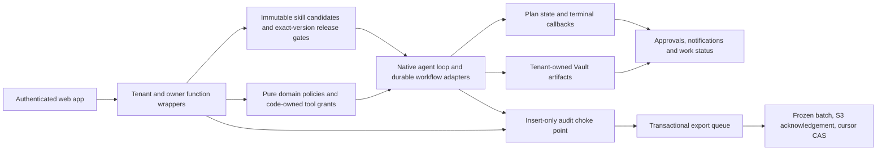

# Merged audit versus current code — 2026-09-10

Current continuation: [September 12 production acceptance](2026-09-12-production-acceptance.md)
records the later repairs and exact release evidence. The current verified production baseline in
that record is `07350fc122ece7d2fbb5ddc5051e699fb2e81d57`; CI
[34826131926](https://github.com/Mrjoel97/ProjectX/actions/runs/34826131926) and production deployment
[34826722003](https://github.com/Mrjoel97/ProjectX/actions/runs/34826722003) succeeded for that exact
commit. It includes Phase 31's approved navigation and direct live desktop/mobile/file/lead
acceptance, Phase 30's exact-byte owner review console, and the deployed Stage 1-3
[research request controls](2026-09-12-research-request-controls.md), including the deterministic
same-row PDF dependency. Native bounded authoring probes and exact vertical-corpus preflight are
deployed; the authorized Phase 23 probe, remaining Phase 23/30 semantic/lifecycle/provider
evidence, authenticated research-control acceptance and the other gates catalogued below remain
open.
The findings and qualification below retain their September 10 scope;
their statements that no deployment occurred and Phase 31 was unimplemented are historical.

Baseline: `3caa762` plus the working-tree repairs documented below. Historical authority came from
[System Audit rev 5](../design/system-audit-2026-09-03-merged.md), its merged build order in §5, and
owner decisions in §6. The owner-adopted **Closure Programme** in §9 of this document now governs
execution order from 2026-09-19 onward. Earlier findings and decisions remain evidence unless §9
explicitly changes their sequencing or disposition. Four parallel investigations examined
reliability, product flows, release evidence and remaining phases. Source files and executable
checks take precedence over retrospective completion prose.

## Findings that change the implementation plan

The system already has the proposed modular architecture: pure TypeScript domain packages, tenant-scoped Convex adapters, code-owned capability grants, immutable skill candidates, explicit approval, a shared audit spine and durable workflow components. A service split would not repair the defects found here. The durable solution is to complete state transitions, preserve evidence at the boundary where it is observed, and make those facts visible to users.

The merged audit is a historical snapshot, not an accurate current backlog. Phases 34–46 implemented much of its agenda. Its original five-worker target was subsequently changed to **15** by ADR-040; treating the new constant as a regression would undo an explicit decision. Its freeze recommendation was rejected in §6: optional phases remain schedulable. Beta remains **free and invite-only**; billing activation and a legal entity cannot be inferred from the earlier recommendation to charge immediately.

The important defects found in the current tree were:

1. **Audit export could permanently omit rows.** `wormCursor.auditSince` used an exclusive event timestamp and `worm.exportAudit` advanced to the largest timestamp in a limited page. A page boundary inside equal timestamps loses its tail; late/backdated events also defeat timestamp watermarks. Durable repair requires a transactional pending-export record, acknowledgement only after successful upload, deterministic object identity, bounded batches and a migration path for legacy omissions. A creation-time cursor alone does not establish commit order.
2. **Folder digest failure had no durable terminal.** `vaultFolders` scheduled `vaultDigest.buildFolderDigest` while completing the folder, but a missing skill or thrown provider failure could leave no digest and no user-visible result. Use the existing Workflow component with retries disabled on the paid step, explicit synthesis status, idempotent completion and an explicit user retry. Synthesis completion must remain distinct from downstream indexing readiness.
3. **Research presentation overstated its evidence.** Search sources survived as URL/title/retrieval time, while successful `readPage` observations did not survive dispatch and persistence. The footer could imply pages were read even in a snippet-only run. Store a system-observed page-read timestamp only after a nonempty successful extraction; preserve it through fan-out, memo and Vault paths; label legacy and unread sources honestly. This does not establish that a page supports a claim, and the separate unsupported-claim verdict must not silently change.
4. **Background work disappeared across chats.** `approvals.listInFlight` covered only delivery. A bounded shared-shell tray can project specialist preparation, rendering and document processing from existing state, link to its originating chat or Vault, and show truncation explicitly. This is a status projection, not a new job executor or a proof that every worker is healthy.
5. **Reconnect deduplication depended on unrelated notification volume.** `gmailAuth.scanExpiringTokens` searched only the first 50 unread notifications for an existing reconnect warning. A targeted tenant/kind/read index provides an exact existence check without an unbounded scan.
6. **Phase evidence and planning disagreed.** STATE said both “phase 47 in progress” and `status: complete`, and repeated an activation blocker after Phase 44 recorded successful activations. Phase 24 already had the corrective-action chains its pending plan called for. Phase 23 lacked its prescribed offline evidence validator. These are different problems and require different dispositions; none is fixed by ticking every requirement.
7. **Tracing defaults violated the documented content boundary.** The installed Foglamp SDK recorded model inputs/outputs by default and serialized raw errors and provider metadata even with content flags disabled. The shared adapter now disables content capture, sanitizes callback paths that bypass those flags, and replaces provider-authored tool-call ids with local trace references. Seven tests exercise the actual SDK transport with sentinel prompts, image bytes, tool results, provider metadata, ids and errors. Traces retain references, usage and status; normal exceptions still propagate to application callers.

## How the implemented system fits together


```mermaid
flowchart LR
  UI[Authenticated web app] --> AUTH[Tenant and owner function wrappers]
  AUTH --> REG[Immutable skill candidates and exact-version release gates]
  AUTH --> POLICY[Pure domain policies and code-owned tool grants]
  REG --> RUN[Native agent loop and durable workflow adapters]
  POLICY --> RUN
  RUN --> PLAN[Plan state and terminal callbacks]
  RUN --> VAULT[Tenant-owned Vault artifacts]
  PLAN --> STATUS[Approvals, notifications and work status]
  VAULT --> STATUS
  RUN --> AUDIT[Insert-only audit choke point]
  AUTH --> AUDIT
  AUDIT --> QUEUE[Transactional export queue]
  QUEUE --> ARCHIVE[Frozen batch, S3 acknowledgement, cursor CAS]
```

The critical boundaries are concrete:

| Boundary | Current mechanism | What it does not prove |
|---|---|---|
| Identity and isolation | `lib/functions.ts` derives tenant/owner context; public adapters validate referenced rows. Vertical previews require the owner before thread writes; ordinary starts independently rerun eligibility. | A frontend hidden button is not authorization. Live two-user acceptance is still required. |
| Instructions and authority | Native skill rows hold immutable versions; provenance, eval and browser evidence gate release. Domain helpers assemble exact tool grants, independent of tier and model prose. | A reviewed prompt cannot grant an absent tool; a registered body is not an activated product. The vertical save-tool integration was tested through the actual shared loop. |
| Paid work and recovery | Existing Workflow orchestration journals bounded work and terminal callbacks. Digest synthesis runs once per workflow; explicit retries start a new attempt. | It does not resume internal computation inside a failed provider call or make arbitrary external writes idempotent. |
| Artifact and outcome truth | Vault writes retain tenant-owned artifacts; successful page reads and deterministic dataset profiles preserve evidence at observation time. Vertical `useful` now requires both grounding and a saved document. | A citation or saved document is not proof of semantic correctness. Model fidelity, useful outcomes and human review remain separate evidence. |
| Operational visibility | Bounded indexed projections expose recorded work and typed audit refs without copying content into status surfaces. | They are neither exact global counts nor worker heartbeats. Bounds can cause conservative omissions that must remain visible. |
| Audit and archive | Audit insertion and queue reference insertion occur in one transaction; upload acknowledgement precedes queue deletion/cursor advance. Frozen batches refuse synthetic cleanup races. | Payload privacy is not guaranteed by `v.any()`. Existing payload checks, retention decisions and real Object Lock receipts still matter; WORM stays off. |

## G1–G26 reconciliation

“Code present” means inspected implementation, not freshly observed production behavior. Historical live evidence applies only to the deployment/version/date it names.

| Gap | Current evidence and status | Durable closure / remaining condition |
|---|---|---|
| G1 terminals and watchdogs | `reliabilitySweep.ts` still arms through `RELIABILITY_SWEEP_ARMED`; it walks media and plan states. `voice.ts` already has its own watchdog. `vaultSweep.ts` already retries stored pending extractions daily. Digest terminal gap repaired in this review. | Observe a production render before arming the destructive sweep; audit the remaining bare chains individually. Do not claim voice and all ingest paths lack recovery. |
| G2 running work | Delivery-only Approvals lane existed; cross-thread shell tray added in this review. | Verify desktop/mobile links and live transitions. Bounded results explicitly disclose partial coverage; no invented exact global count. |
| G3 memo formatting | `MemoCard.tsx` renders markdown and sources. | Preserve source/footer regression tests. |
| G4 research depth | Phase 39 added restricted `readPage`; this review persists successful read observations through `llm.ts`, `dispatch.ts`, `research.ts`, plan/Vault rows and fan-out. | Paid candidate evaluation and real source-quality adjudication remain separate from offline provenance tests. Never label near-miss sources as supporting evidence merely because they were read. |
| G5 document canvas | Phase 40: inline PDF, `vaultSheets`, `SheetGrid`, XLSX generation and ADR-036. | Current signed-in output/download verification, especially legacy/unavailable cases; no need for another canvas architecture. |
| G6 durable specialists | `dispatchRun.ts` journals one paid action with `retry:false`, completion callback and component status lookup. Root/child plans and governed fan-out exist. | This establishes durable orchestration and an honest terminal, not resumable computation inside a 30-minute model call. Long tasks need checkpointed bounded work units before increasing timeouts. ADR-040 now sets the fan-out limit. |
| G7 one-click packs | `workflowPackDiscovery.ts`, immutable skills, quick starts and manual pinned reruns exist. | Optional verticals are still new work; verify exact active production versions rather than reuse the stale candidate inventory. |
| G8 media live proof | Current provider migration code and render paths exist; historical evidence is scattered. | Capture completed current-provider video plus sidecar and Vault persistence on the exact released revision; an accepted submit is not a completed render. |
| G9 DLQ and environment | Owner-scoped operational surfaces, env manifest and superseding ADRs present. | Maintain redaction and role tests; record outstanding owner attestation separately. |
| G10 content batches | Phase 43 `createVariants`, root/child queue, timed and untimed approval paths present. | Verify real batch publication and cancellation on current version; preserve one approval and channel-specific terminals. |
| G11 media persistence | Image/reel Vault persistence code present. | Current image and completed-video readback; legacy absence must remain visible. |
| G12 approval feedback | Code and later deployments exist; remaining scheduler implementation jargon removed from cancellation copy here. | Do not equate local fixes with deployment. |
| G13 proactive agenda | Phase 34 `agenda.ts`/`lib/agenda.ts`, goals and proposal-only path present. | Observe a useful proposed action and resulting artifact with a real beta user. |
| G14 concept load | Phase 25.2 removes many tenant operations/configuration surfaces. | Continue user-tested copy simplification; preserve owner-only capability boundaries. |
| G15 mobile cockpit | Responsive split-pane and bottom navigation exist. | Re-run mobile UAT; Phase 45 records unresolved pack discovery/preview viewport failures. A responsive stylesheet alone is insufficient proof. |
| G16 entry | Invite-only signup, waitlist and connect framing exist, matching owner decision. | A fresh invite must reach a first useful result without owner assistance. |
| G17 scaling | Deployment budgets now read env; batch migrations replace several full scans. WORM paging and reconnect dedupe defects found here. | Complete safe archive repair and bounded notification lookup. Tune caps using observed usage; no evidence supports the snapshot's 10k/100k/500k capacity claims. Load-test before publishing those numbers. |
| G18 releases | CI and deployment workflows exist; Phase 45 records recent promotions. | Qualify exact SHA, secrets presence without disclosure, deployed smoke and rollback. A local green build is not a promoted release. |
| G19 dark activations | Merged audit's updated G19 and Phase 44 record production cockpit/research/pack activation. STATE's universal blocker was stale. | Read current registry before further activation; new candidate changes still require their own gates. |
| G20 legal entity | Owner deferred until beta evidence. | Non-code owner work; Gmail reconnect/reauth remains critical during free beta. |
| G21 pricing | Owner chose free beta; Phase 28.1 is parked deliberately. | Retain cost ceilings. Price/metering decisions follow measured usage; no billing activation is implied. |
| G22 revenue connector | QuickBooks code and operator sealing seam exist. Phase 45 diagnoses an unreadable Intuit app record; the audit's “only consent remains” is stale. | Provider repair, real grant/read/revoke proof, then strict provider/subset gate. Never fabricate completion from configured client credentials. |
| G23 promise and proof | Phase 35 outcome language and offer/lead-plan artifact exist. | Behavioral first-outcome measurement; don't claim a bank-deposit outcome from a memo. |
| G24 smoke routing | Phase 36 moved fixture selection out of band and added guards. | Preserve positive controls and production-tenant separation. |
| G25 recurrence | ADR-046 exists; `dstProbe.ts` and collector exist. ROUT-02 still records `defer`. | Real DST scheduler trace and OAuth expiry/reauth trace, validated artifact, accepted supersession, then schedule/run implementation with reservation release, overlap/pause fencing and DLQ. Do not rename modules to evade the absence proof. |
| G26 planning | Structural checker exists; semantic drift survived it. | Reconciled STATE/requirement notes and this dated report. Completion requires acceptance evidence, not simply a SUMMARY filename. |

## Remaining phase work, in executable order

| Phase | What can be implemented/verified locally | What remains before full closure |
|---|---|---|
| 23 agent-authored skills | Exact closed handoff/eval/live artifact validation, immutable file writing, adversarial tests and opt-in dual-identity auth preparation. | Authenticated genuine authoring, exact-row full paid eval, non-owner refusal with unchanged state, owner UI activation and real rollback. Plans 23-06–09 must not be marked complete from validator tests. |
| 21 user-authored skills | Native versioning and phase requirement evidence exist; the stronger 21-08 acceptance protocol is still partial. | Do not equate verified phase criteria with every plan's remaining acceptance step. Keep the explicit incomplete plan visible. |
| 24 evidence map | Existing map mechanically verified: 20 matrix rows, 2 complete corrective-action chains, 58 local paths resolve. | Named owner/reviewer and semantic scope/gap disposition review. Organization-wide clauses and live WORM remain limited. |
| 25 beta productionization | Existing admission/isolation/deployment/Outlook code and harnesses need exact-current-revision qualification. | Two real isolated users, self-served first result, timing evidence, hosted release checks and Outlook mailbox send/thread/read evidence. The Microsoft calendar concurrency probe is not evidence that Outlook mail transport cannot work. |
| 28 revenue | Provider/subset validation exists; QuickBooks adapter work is present. | Live provider eligibility and revocation evidence plus strict 28-27 subset seal. Other providers have independent product/permission/revocation conditions. |
| 27 curated packs | Later evidence closes six exact-version evals and activation/rollback lifecycle. | 27-09 still lacks the full per-pack positive/partial/refusal/edit/reject/injection/privacy browser protocol. Viewing cards and one preview does not prove every workflow. |
| 28.1 billing | Code sealed and parked under free-beta decision. | Owner price/merchant/tax setup and live billing proof when monetization is chosen. |
| 29 knowledge/manual routines | Thirteen plans recorded complete; pins are inert until a human runs them. | No permission to infer recurring execution from manual reruns. Recurrence belongs to 47. |
| 30 vertical packs | Closed policy and native controls, six pinned draft candidates, deterministic Data, owned Design image input, workload confirmation UI and exact-case evaluation observation infrastructure are implemented. | Independent method reviews, complete observed semantic/outcome assertions and real evaluations (30-08), authenticated all-six responsive UAT (30-09), two evaluated versions per vertical and six lifecycle drills (30-10). The evaluator's remaining acceptance work is an implementation gap, not an external-only blocker. |
| 47 recurring execution | Probe/collector and clock arithmetic already exist. | Required real traces are absent; after gate supersession implement standing approval read/prepare only, structured material-change comparison, one active run, skip-never-burst, bounded terminal classes, upfront envelope reservation and idempotent settlement. |

Phase 31's marketing surface/funnel remains a separately planned eight-plan product tranche;
Phase 32 channel publishing is still tied to the legal-entity/provider prerequisites. Neither is
made complete by this audit repair. Phase 33.1-06 still requires completed current-provider media
evidence. These must remain visible in the broader roadmap rather than disappearing behind a
claim that all remaining phases were implemented.

## Implemented repairs and local phase preparation

- **WORM correctness:** ADR-048 specifies a transactional `auditExportQueue`, immutable frozen
  batches, content-addressed objects and compare-and-swap acknowledgement after upload. Legacy
  rows use native pagination instead of event-time watermarks. The independent review additionally
  found and repaired synthetic-tenant purge leaving dangling queue refs, deletion racing a frozen
  batch, and canonical JSON dropping an own `__proto__` field. Normal erasure preserves the
  retained audit/queue checkpoint. This work does not arm WORM or settle ADR-044 retention/privacy.
- **Digest completion:** the existing Workflow component now owns orchestration, with one paid
  synthesis attempt, explicit completion/failure/refusal state and safe user retry. Concurrent
  rebuild requests coalesce. Tests distinguish generated content from later searchable readiness.
- **Research honesty:** successful nonempty reads acquire system-observed timestamps, preserved
  through persistence and displayed separately from snippet/legacy references. No semantic support
  verdict was inferred from a successful fetch.
- **Operational visibility:** a cross-thread shell projection covers recorded preparation,
  delivery, rendering and document processing. Fourteen full-row reads keep it under Convex's
  read-byte ceiling; a full lane discloses a limited view. It is not an exact workload count and
  excludes caption-only work on completed plans. Gmail reconnect checks now use a targeted index.
- **Phase 23:** closed immutable evidence validation, a runnable opt-in dual-identity browser
  harness, read-only governing-state inspection and an isolated in-memory owner-guard mutation
  check are implemented. The check went green/red/green without editing deployed source, using
  real authorization behavior. No live handoff/eval/activation/rollback evidence was fabricated.
- **Phase 30:** six source-pinned draft bodies and separate provenance inventory, deterministic
  Data core and bounded existing-SheetJS adapter, tenant preferences/disable/rollback, closed audit
  telemetry, dormant native candidate registration/binding, and at-most-two contextual profile
  suggestions. Publication and execution gates reuse native immutable rows; pilot identifiers
  and tool authority remain separate. UI starts recheck eligibility on the server and pass no
  owner preview pin. Disabling can be reversed without deleting saved artifacts.
- **Planning integrity:** the CI checker now treats explicit partial/blocked/draft summaries as
  unfinished, with a regression fixture proving false closure fails. Historical completion prose
  is reconciled against later evidence instead of overwriting past failures or inventing approval.

The vertical evaluation tool is **not a completed release evaluator**. It now provisions controlled
owned source files, supports actual Design image input, reserves aggregate model-call budget and
collects actual request/candidate/source/tool/artifact facts. Collection uses fixed sources and
does not claim to test RAG selection. Scripted execution is marked explicitly. Semantic citation,
refusal, disclaimer and per-vertical outcome assertions still require completion and review;
neither collected observations nor fixture expectations produce passing native evidence. See
[30-08 eval preparation](../phases/30-optional-vertical-workflow-packs/30-08-EVAL-PREPARATION.md)
for the concrete implementation boundary. Independently reviewed methods, a completed evaluator,
exact-version model evidence, all-six authenticated responsive UAT and lifecycle drills remain.

### Follow-up implementation during the resumed review

- The workload picker closes the first-use confirmation gap. It requires two distinct owned ready
  unsealed artifacts and explicit consent, preserves other preferences, and pages past sealed rows
  without leaking content or foreign-tenant records. Sixteen component interaction/render tests pass,
  including the recommendation subscription's accessible loading-to-settled signal.
- Design now receives actual owned PNG/JPEG bytes through the existing model loop. Its reader checks
  status, folder seal, MIME/container signature, a 1 MiB bound and exact byte hash. Thirteen reader
  tests pass. Meaningful synthetic screenshot fixtures replace placeholder descriptions; these are
  inputs, not evidence of model visual understanding or accessibility compliance.
- The evaluation binding pins the actual request hash as well as the case, native candidate and
  source hashes. Its scripted integration traverses real stored text, the normal search/save tools,
  an actual Vault artifact and real reservation/settlement mutations. Data/image selection is
  constrained to the provisioned refs and exact bytes. Source failures stop subsequent paid calls.
- Model-call reservations share the existing spend-event and rate-limiter plane. Every low-level
  call, including fallback, reserves a conservative documented request ceiling. Unknown cost keeps
  its hold; known provider-contract breaches persist actual cost and close further admission. The
  tool does not promise to cap unsupported external BYOK bills. Cleanup preserves accounting and
  its authority receipt across partial pages; it must not erase an unresolved execution's evidence.
- The shared tracing repair above also protects the newly introduced image/source paths. It is a
  central configuration and callback fix, with no alternate model loop or tracing service.
- Offline review tooling binds collected output and source bytes, recomputes deterministic Data
  reference facts, and validates reviewer-authored evidence spans. Every semantic criterion starts
  unresolved; local packets cannot authenticate observations or reviewer qualifications and never
  become native release evidence. The command is usable after actual collection and refuses source
  drift or overwriting an existing review.
- An opt-in authenticated desktop/mobile control harness covers all six exact configured candidate
  identities. It exercises explicit workload confirmation and checks dark/released control states.
  It makes no model calls and cannot prove positive artifact workflows or owner acceptance. The
  dedicated test tenant retains server-recorded historical confirmations; reversible preferences
  are restored and restoration failures remain visible.

## Durable release order

1. Review and qualify this combined code revision. Deploy compatible schema/index changes with
   the application and rerun tenant-isolation and authenticated desktop/mobile smoke checks on
   that exact revision. Local checks are not release receipts.
2. For audit export, keep WORM off, drain old audit writers, deploy transactional writes and only
   then start the legacy scan under ADR-048. Old writer drainage matters because creation time
   alone is not commit order. Arming additionally requires the existing retention/privacy gates,
   real bucket Object Lock evidence and owner disposition. Repeated uploads preserve the same
   frozen bytes; acknowledgement is never inferred from starting an upload.
3. Qualify current media terminals, first-result behavior for two real beta tenants, reconnect
   and mailbox/provider paths. Use observed cost/latency/outcome data to tune limits; do not
   publish capacity claims from constants or promote an accepted video submit to a completed clip.
4. Complete Phase 23 live exact-row evidence and Phase 30 evaluation infrastructure/review before
   any new candidate exposure. Keep recommendations at zero when behavioral evidence is insufficient.
5. Preserve free beta and the explicit recurrence defer decision. Run the real DST/OAuth probes,
   record their validated traces and accept the required gate supersession before implementing
   recurring paid execution. New names, mock clocks and tests cannot substitute for those traces.

## Verification record

The first resumed baseline had passing 12-package typecheck and all 17 then-registered free gates (2026-09-09). The table below records the first completed integration pass; the follow-up implementation requires its own final qualification below.

On 2026-09-10 the two exact Phase 24 plan assertions passed: two complete evidence chains; 20 matrix rows and 58 resolving local paths. No owner review or live conformity claim was inferred.

Final integration evidence, collected against the working-tree implementation:

| Check | Result and scope |
|---|---|
| TypeScript | All twelve workspace projects typechecked. Final backend and web checks passed after fixing a sparse-workbook fixture API mismatch and narrowing the start response before using its thread id. |
| Lint | Biome's CI check passed across 967 files. Existing nonblocking warnings were not promoted to errors or silently auto-fixed. |
| Production build | Next production build passed, including TypeScript and all 31 static pages. Network access was needed for the app's existing Google Fonts imports; no deployment was performed. |
| Offline gates | All 20 registered gates passed on the frozen source, including Phase 23 artifact/owner-boundary checks, provider lanes, recurrence and vertical preparation. Registry self-test passed. A provider self-test failed during an earlier concurrent run; two direct reruns and the final registry pass succeeded. The original summary-only log cannot establish the transient failure's cause. |
| Backend unit suite | Final plain run passed: 149 files, 4,182 tests, exit 0 and no unhandled worker error. Earlier broad and diagnostic runs exposed a cockpit scheduler-cleanup race; it was fixed in the harness before this final run. Runner defaults and application behavior were not weakened. |
| Core / contracts / Vault | Full suites passed: core 1,586; contracts 127; Vault 192. Sparse workbook behavior and source inventory drift were corrected before their final passes. |
| Web | 973 assertions passed across the complete suite plus the isolated follow-up, with two existing skips. The full concurrent run had one 5-second local subprocess timeout; the unchanged ten-test subprocess suite passed in isolation. Eight new vertical UI tests include actual action and preference interactions. |
| Other workspace suites | Billing 156, cost 95, extraction 28, PII 8, revenue 340 and voice 57 passed in the broad integration sweep. |
| Provenance and planning | 32 imported files matched the exact pinned two-way source inventory; six draft records remain explicitly non-release evidence. Planning regression test, current corpus check and playbook coverage passed. |

The Phase 23 browser spec was prepared and listed, not executed as live evidence. Vertical scenario
validation covers six candidates and forty input cases. Native diagnostic collection is now implemented,
but both collection and the closed release command exit 2 while semantic/release acceptance remains
outstanding. Neither preparation nor scripted execution counts as model UAT.

The cockpit cleanup failure was attributed to the installed Workflow component's deterministic
environment temporarily deleting `process`. Interleaved scheduled work from separate tests outlived
their clocks and interfered with restoration. The repaired harness owns fake timers per test,
drains registered delivery/fan-out harnesses sequentially, clears pending timers only after
in-progress work settles, and checks the original process identity after every test. The focused
80-test suite and the final full backend run both passed. No error-ignore option, library patch,
production workaround or weakened assertion was used.

No deployment, skill activation, provider consent, external message or live recurring execution was performed by this review. Repository-local verification cannot settle those acceptance conditions.

The repository graph refresh exceeded its bounded runtime twice (normal and no-cluster paths).
All four pre-existing graph artifacts were backed up and restored before a limited Convex fixup:
11,031 nodes, 18,483 edges, one added node and eight added edges, zero dangling edges. The graph
and report explicitly mark AST, relationship coverage and analytics stale/incomplete. New vertical
modules and `beginExport` are absent; this is not a completed structural refresh. The source review
and executable tests, rather than the partial graph, support the implementation findings.

A later full refresh completed after release `93d905d5`. The current generated report records
11,062 nodes, 18,333 edges and 661 communities with 99% extracted, 1% inferred and 0% ambiguous
relationships. Its manifest and graph include the research-control source, tests and
`researchControls` table. This supersedes the partial-graph condition above for the current release;
the paragraph above remains the evidence boundary for the September 10 review itself.

### Follow-up final qualification

The later workload, visual-input, evaluation-accounting, tracing and review-tool changes were
qualified separately from the first integration pass above. No paid model or authenticated browser
workflow was executed to produce these results.

| Check | Final result and practical scope |
|---|---|
| Backend suite | **156 files / 4,264 tests passed**, exit 0, no unhandled worker error. The two subsequently added offline review suites passed **31 additional tests**; their CLI test uses the real review-packet module and actual file/source bytes. |
| TypeScript | All twelve workspace projects passed. Backend and web were checked again after the follow-up additions; Vault was checked again after its two equivalent self-package imports enabled direct Node reuse. |
| Lint | Biome CI passed across **988 files**, with 399 existing nonblocking warnings. No blanket suppression or dependency patch was added. |
| Production build | Final Next build passed with **31/31 static pages**, after the accessible subscription-state marker and parser import changes. Existing Google Fonts imports required network access. No deployment occurred. |
| Free gates and preparation | All **20 registered free gates** and the registry self-test passed in the integration pass. The final fixture-only command again passed for six candidates / forty cases after the review tooling landed. |
| Evaluation mechanics | 31 mechanical-observation tests; 39 source/cleanup tests; 9 collector/preparation tests; 13 owned-image tests; 12 final reservation/model-middleware tests. These verify code boundaries, not semantic model quality. |
| Review and parser | 22 review-packet/record tests plus 9 CLI integration tests. A further 48 focused workbook/sniff/extract-kind tests passed, and the review CLI loads directly in Node. Evidence spans are checked against actual bytes; reviewer identity and qualifications remain unverified. |
| UI and browser preparation | **16 UI tests** passed. **24 opt-in desktop/mobile browser control cases** list successfully; none ran against a signed-in target. They cover controls, not all-six positive artifact workflows. |
| Tracing | Seven real AI SDK/Foglamp callback-to-transport tests passed with mocked model/fetch, including raw provider errors and tool-call identifier leakage. No tracing/model network operation was performed. |
| Documentation and provenance | Planning corpus and its false-closure regression, playbook coverage, and whitespace checks passed. All 32 imported source files still match the pinned inventory; draft records remain non-release evidence. |

The follow-up broad run first exposed missing explicit module/event registrations, which were fixed
without weakening the inventory checks. A subsequent run exposed the weekly-review harness draining
an unregistered downstream Workflow component. Its eight tests now assert queued review targets,
replay the exact arguments through the real action, and verify the durable dispatch handoff. The
final full backend run passed after that repair; downstream specialist completion remains the
responsibility of the existing registered workflow suites.

Useful local logs: `.tmp/audit-followup-backend-qualified.log`,
`.tmp/audit-review-tools-web-build.log`, `.tmp/audit-review-tools-lint.log`,
`.tmp/audit-followup-free.log`, and `.tmp/audit-review-tools-fixtures.log`. These are working-tree
verification records, not immutable deployed-release receipts.

### September 14 working-tree continuation

Two remaining implementation seams are now offline-qualified in the working tree. Phase 30 has a
closed owner review console keyed by exact run UUID. Native receipts bind output hash, UTF-8 byte
length, stable per-leaf criteria and observed outcome/tool facts; deterministic review resolves only
mechanical facts, while semantic decisions require explicit byte-bound evidence. Current-pin drift
is visible and blocks finalization. Finalization cannot activate candidates, and Legal/HR remain
blocked until a separately qualified external attestation mechanism exists.

Stage 3 of the research-control plan now accepts an explicit memo/PDF deliverable contract. PDF
materialization waits for the exact successful research artifact, deterministically attaches bytes
to that same `web_research` Vault row, and uses tenant/request/plan/type/hash checks plus compare-and-
swap replay handling. It makes no second model call or duplicate document. Missing, deleted, stale,
incomplete or canceled dependencies land explicit terminal states.

Focused validation passed: Stage 3 **6** tests, Phase 30 evidence **23**, admin console **12**,
workspace controls **19**, backend and web typechecks, and one dispatch integration test. The full
release gate then passed **7,841** tests (two recurrence checks intentionally skipped) plus the
production build. Exact source `07350fc122ece7d2fbb5ddc5051e699fb2e81d57` passed CI
[34826131926](https://github.com/Mrjoel97/ProjectX/actions/runs/34826131926) and production deployment
[34826722003](https://github.com/Mrjoel97/ProjectX/actions/runs/34826722003), including Convex deploy,
registry verification, staged probe, Vercel promotion and durable production URL verification. The
earlier failed research PDF and incomplete paid Phase 30 run remain historical evidence and are not
superseded.

The authorized Phase 23 continuation was attempted against this release with the two controlled
identities. Fresh A/B native sign-in, non-owner isolation and owner bootstrap passed, but the run
failed closed during A's second native sign-in while the browser stayed on `Signing in…`; no handoff
artifact was certified, no full evaluation or activation was attempted, and source integrity held.
The follow-up harness repair landed in `410aec9` (wait for the signed-out UI before reauth) and
`40a6553` (scrub the password field on auth failure). The 2026-09-14 read-only reconciliation then
matched the exact authorization hash to one closed, expired production budget: $0 actual spend,
zero calls, zero started probe turns, zero unsettled reservations and no breach. Exact source-thread
inspection and authenticated `/ops` both found no candidate. This supersedes the earlier inference
that a server-side candidate authoring turn passed; see
`.planning/phases/23-agent-authored-skills/23-PRODUCTION-RECONCILIATION-2026-09-14.md`.

**Work remains.** Phase 30 still needs independent method review, actual exact-candidate evaluations,
authenticated semantic decisions and qualified Legal/HR attestations, all-six workflow UAT and
lifecycle drills. The native producer, console, review packet and free control harness make those
tasks executable and inspectable but do not close them. Phase 31 was subsequently implemented and
its navigation was activated after direct production acceptance. Provider/legal prerequisites,
current media proof, the other acceptance work in the phase matrix, and the deferred Phase 47
recurrence implementation remain. WORM is off and no candidate was activated.

## Independent cross-cutting reconciliation

This section incorporates the independent codebase review without creating a competing roadmap or
changing the existing G1–G26 findings. The merged audit remains the single source of truth. The
historical executable phase order is superseded by the owner-adopted Closure Programme in §9.
These controls support release qualification; they do not close live acceptance gates by
themselves.

### H1 — Deterministic production build

Attach to G18. The current web build depends on network access for the existing `next/font/google`
imports and reports an unexpected NFT trace through the local media-render path. The audit's prior
network-enabled production build remains valid and is not contradicted. Before treating a release
build as fully reproducible, guarantee the required fonts during clean CI/release builds, resolve or
explicitly bound the media route's filesystem trace, and address the deprecated Next.js middleware
convention. Qualification must be recorded against the exact source revision.

### H2 — Stronger audit and dead-letter contract enforcement

Attach to G9/G26. The existing refs-only and insert-only rules remain the governing behavior, but
`v.any()` does not enforce payload privacy at the schema boundary. Add defense-in-depth through
centralized typed audit/dead-letter writers, runtime validation that rejects raw content and personal
data, and tests that preserve insert-only behavior. This is hardening of an existing boundary, not a
finding that the current audit model should be replaced.

### H3 — Test-harness observability

Attach to G18/G24. The package and web suites may remain green while offline Convex fixtures emit
expected component-registration errors. Keep the existing assertions and registered production
behavior intact, but isolate or register expected fixture components so test output distinguishes
known harness limitations from real failures. Add or preserve a small authenticated live-contract
smoke against the promoted revision; unit tests and free gates remain distinct from live evidence.

### H4 — Secret and artifact hygiene

Attach to G18. Ignored environment files, backups, and key-like local artifacts must not become an
accidental release input. If any represent genuine credentials, rotate them; remove unnecessary
copies; and retain automated secret scanning and redacted diagnostics. This is an operational
release control and does not imply that a tracked secret or compromise has been found.

### H5 — Maintainability decomposition after private beta

This is post-beta maintainability work, not a current release blocker. Do not introduce a service
split or use one as a remedy for the audit gaps. After the private-beta evidence gates close, the
largest internal modules (`llm.ts`, `media.ts`, `cockpit.ts` and related orchestration files) may be
decomposed along validation, persistence, provider and orchestration seams while preserving the
pure TypeScript domain packages, Convex boundary, tool-grant rules, audit contracts and exact-release
evidence model.

### Unified position

- No major architecture rewrite.
- No service split.
- No new roadmap breadth while admitted beta work remains incomplete.
- Recurrence implementation belongs to Closure Wave 6; exposure still waits for its real
  DST/OAuth and governance gates.
- Candidate exposure belongs to Closure Wave 4 and occurs only after exact-version evaluation,
  owner approval, isolation and rollback evidence.
- Billing implementation completes in test mode in Closure Wave 5; live charging belongs to the
  external-enablement gate in Wave 7.
- WORM implementation may reach technical readiness in Wave 6; activation still waits for the
  retention, privacy, Object Lock and owner gates.
- Close admitted beta scope through the Wave 0-8 programme below, with live evidence and
  exact-release qualification at the points that programme defines.
- Treat build determinism, audit-boundary hardening, test observability, and secret hygiene as
  supporting release controls.
- Schedule internal module decomposition after the private-beta evidence gates are closed.

## 9. Owner-adopted Closure Programme — 2026-09-19

### 9.1 Authority and objective

The owner has adopted this section as the standing execution reference until the intended first
beta is complete. It supersedes the earlier Phase 23 → Phase 30 → Phase 25 execution pointer and
any recommendation to abandon already-admitted breadth merely because it is optional in a narrower
launch. It does **not** erase the evidence, safeguards, owner checkpoints, provider gates or open
acceptance criteria recorded elsewhere in this audit.

The objective is to finish the beta that was actually planned: close the existing partial
implementations in dependency order, integrate them into one coherent product, defer formal
legal/commercial applications until the technical product is ready, and qualify one exact release
before inviting the first beta cohort. This is a closure programme, not a scope cut and not a new
feature programme.

The operating distinction is binding:

- **Finish existing breadth:** every phase already admitted to the intended beta remains in scope
  unless the owner explicitly removes it.
- **Do not create new breadth:** no new feature family or roadmap phase is admitted while the
  closure programme is active, except a narrowly scoped repair required to close an existing
  acceptance criterion.
- **External work is sequenced, not forgotten:** legal formation, formal provider applications,
  merchant activation and public-channel applications are deferred to Wave 7. Technical provider
  tests required to prove the application are still technical work and occur in their owning wave.

### 9.2 Completion states — no indefinite partial or parked work

Every admitted phase, plan and workflow must end in exactly one of these states:

| State | Meaning | Required evidence |
|---|---|---|
| **Closed** | Implemented, integrated, deployed and accepted at the level its contract requires. | Exact source revision, automated gates, user-visible acceptance path and any required live/provider evidence. |
| **Technically ready for external gate** | All repository-controlled work is complete; one named provider, legal, merchant or time-bound action is the only remaining condition. | Clean technical acceptance packet, disabled/hidden exposure, exact external prerequisite and a re-entry test. |
| **Superseded and archived** | A later implementation genuinely replaced the plan; it is not unfinished work. | Named successor, requirement mapping and preservation of historical evidence. |
| **Removed by owner decision** | The owner explicitly removed the item from the intended beta. | Dated owner decision and updates to requirements, roadmap and user-facing claims. |

`Partial`, `parked`, `draft`, `blocked` and `in progress` are temporary execution states only. They
must not become permanent dispositions. A SUMMARY file, landed commit, green unit suite or deployed
route is not enough by itself to move an item to **Closed**.

### 9.3 Universal workflow definition of done

Each workflow closes against one consistent contract. Where an arm is genuinely inapplicable, the
closure record must say why rather than silently omit it.

1. The happy path reaches the intended user outcome.
2. Missing prerequisites produce an actionable refusal before irreversible work or spend.
3. Provider/model failure reaches a durable, user-visible terminal.
4. Retry is explicit, bounded and idempotent; it never silently double-spends or double-sends.
5. Cancellation and halt behavior are honest about work that has already committed.
6. Navigation, refresh, reconnect and cross-thread recovery preserve the recorded state.
7. The approval that authorized an outbound action is linked to its resulting action and audit
   record.
8. Tenant isolation and owner-only boundaries are tested at the server boundary; a hidden control
   is not authorization.
9. Cost reservation, actual cost and settlement use the existing accounting plane and leave no
   unexplained hold.
10. Loading, empty, partial, refusal, error and success states are usable on desktop and mobile.
11. User-facing claims match enforced code paths and current provider capability.
12. The exact promoted revision is qualified; local tests do not become production evidence.

### 9.4 Execution rules

- One closure wave is active at a time. Work inside it may run in parallel only when dependencies,
  shared files and irreversible state permit.
- Shared hotspots such as `llm.ts`, `schema.ts`, `cockpit.ts`, `media.ts`, skill activation and
  production registry state have one integration owner per wave.
- Existing plans are not replayed blindly. Each open phase receives a small current-code delta plan
  that names the remaining acceptance gap and reuses the implementation already present.
- No later wave begins while an earlier wave has an unmet repository-controlled criterion. A truly
  external condition may move to **Technically ready for external gate** with its acceptance packet;
  vague dependence on the owner or a provider is not enough.
- Paid model calls, provider writes, candidate activation, live billing, WORM activation and other
  irreversible or externally material actions keep their existing explicit authorization gates.
- Each completed wave ends with a clean mainline state, reconciled ROADMAP/STATE/REQUIREMENTS,
  updated playbooks and ADRs, exact verification evidence and no unexplained generated artifacts or
  stale execution pointer.
- No claim of completion may be derived solely from plan counts. Acceptance facts govern.

### 9.5 Wave 0 — One truthful closure ledger

**Purpose:** establish one complete, dependency-aware inventory before implementation resumes.

For every open, partial, blocked, draft or historically contradictory plan:

- identify what exists in current code;
- distinguish offline-tested, deployed and live-observed behavior;
- name the exact unmet acceptance criterion;
- classify the remaining work as code, integration, browser evidence, semantic/model evaluation,
  provider access, owner judgment, time-bound evidence or legal/commercial work;
- map its current requirement and successor, if any;
- assign it to Waves 1-8 and record its entry and exit gate;
- identify user-facing claims that depend on it;
- identify dirty working-tree, branch, worktree or generated-artifact state that could confuse the
  baseline.

Wave 0 produces one closure ledger inside this audit's authority, not another competing audit. It
also reconciles `PROJECT.md`'s stale audience/status language, the ROADMAP progress table,
REQUIREMENTS traceability and STATE's execution pointer. It does not rewrite historical evidence.

**Exit gate:** every admitted beta item has one current state, one wave, one dependency chain and
one objective closure test; every superseded item has a named successor; no unfinished item is
hidden behind completion prose.

#### Named Wave 0 capability audit — business websites, landing pages and online shops

The owner has explicitly asked that Pikar's ability to create a business's public web presence be
decided during closure rather than inferred from adjacent marketing, document or billing work. The
Wave 0 ledger must therefore contain separate rows for:

- a multi-page business website;
- a campaign landing page with lead capture and measurable conversion events; and
- an online shop with product catalogue, inventory posture, cart, merchant checkout, order state,
  customer notification and fulfilment hand-off.

The preliminary code reading on 2026-09-19 does **not** establish any of those three as a complete
user capability. Pikar can render a self-contained HTML document, but that is not a maintained,
responsive, routable website. The marketing surface can create tracked public links to downloadable
Vault artifacts and record leads, but its tests deliberately confine writes to link management and
lead capture and exclude publisher hooks. The repository's Stripe Checkout is Pikar subscription
billing, not checkout for a tenant's customers. These are useful primitives, not evidence of a
website builder or merchant storefront.

For each of the three rows, Wave 0 must verify and record:

- how a non-technical user requests, previews, edits, approves, publishes, updates, unpublishes and
  rolls back the result;
- supported sections/pages, navigation, brand inputs, responsive behavior, accessibility, SEO,
  analytics, forms, consent/privacy controls and custom-domain behavior;
- whether output is a downloadable code bundle, a Pikar-hosted site, or a deployment to an external
  host, and who owns source, domain, data and credentials;
- tenant isolation, prompt/content safety, secrets handling, audit history, cost bounds, failure
  recovery and exact-release acceptance;
- for shops specifically, catalogue and inventory source of truth, taxes, shipping, refunds,
  payment-provider ownership, PCI boundary, order lifecycle and the distinction between Pikar's
  own billing and the business's merchant payments; and
- the exact implemented/partial/missing classification, dependencies, beta disposition and closure
  test. A generated HTML file, mock-up, screenshot or unpublished preview cannot satisfy the
  published-site criterion; a payment link alone cannot satisfy the online-shop criterion.

The provisional route is: creator/editor/preview/publish/hosting and landing-page runtime work joins
Wave 3; reusable website, landing-page and storefront recipes join Wave 4; merchant commerce
connectors and order/payment lifecycle work joins Wave 5; domain, merchant, provider and policy
enablement joins Wave 7; exact-release creation-to-public-use qualification joins Wave 8. Wave 0 may
refine that routing after the dependency audit, but it may not silently remove any of the three
owner-requested capabilities.

### 9.6 Wave 1 — Historical foundation and acceptance debt

**Purpose:** remove old open gates that later workflows depend on without rebuilding completed
foundations.

Scope:

- Phase 1's remaining technical OAuth/consent-flow work. Formal verification submission is deferred
  to Wave 7 unless it is unavoidable for a technical live test.
- Phase 3.7 inbox-briefing current-version skill/evaluation/live acceptance.
- Phase 17.1 Blueprint/RAG production acceptance and evidence that the active model receives the
  intended business spine.
- Phase 18's remaining document live gate, playbook/roadmap corrections and Blueprint-drift
  dependency.
- Any active-skill, registry, fixture or evidence dependency strictly required to close those
  items.

Use delta plans against current code. Old acceptance commands and candidate identities must be
revalidated before use; no stale candidate or historical active version is assumed current.

**Exit gate:** the foundational consent path is technically exercisable; inbox briefing,
Blueprint grounding and document creation have current-version acceptance; no Wave 2 workflow
depends on an unresolved historical plan.

### 9.7 Wave 2 — The complete end-to-end product spine

**Purpose:** finish the first-user journey before qualifying the breadth attached to it.

The required journey is:

```text
invite
  → sign in
  → onboarding
  → connect provider
  → request work
  → receive draft or artifact
  → approval
  → execution
  → visible result
  → audit record
  → return and reuse
```

Scope includes the repository-controlled remainder of Phase 25 and the cross-cutting product gaps
needed by all later waves:

- user-visible first governed self-send, with authenticated address derivation;
- inline recovery for missing postal address, mailbox connection and other safe prerequisites;
- one approval inbox for all pending outbound actions;
- a chronological user audit/history view linking each outbound result to its approval and typed
  audit references;
- running-work and completed-result visibility across navigation and chats;
- honest loading, empty, partial, refusal, timeout, failure, retry, cancel and reconnect states;
- desktop and mobile acceptance paths;
- time-to-first-governed-outcome, first-run step completion, activation funnel, session count,
  week-two return and monthly cost-per-active-user instrumentation;
- an enforceable claim-versus-code control for product, marketing, onboarding and legal copy;
- exact-release qualification infrastructure needed to repeat these checks later.

Phase 25's final two-real-user and beta-cohort evidence remains for Wave 8. Wave 2 finishes the
product code and internal acceptance path it needs.

**Exit gate:** five controlled internal runs complete the full governed-send journey within the
defined threshold; every required metric is queryable without manual reconstruction; no outbound
action bypasses the approval path; the user can inspect the resulting record.

### 9.8 Wave 3 — Operational capability closure

**Purpose:** close the principal working surfaces against the universal workflow definition of
done.

Scope:

- Gmail inbox, briefing, reply, deferred send, reconnect, delivery and suppression behavior.
- Google Calendar creation, availability, management, conflict behavior and rollback/refusal.
- Microsoft mail/calendar implementation that can be completed before formal external approval;
  blocked live-provider conditions receive an exact external-gate packet.
- Vault upload, format extraction, OCR/transcription, search, folders, synthesis, retry and Drive
  browse/import.
- Research request controls, bounded page reads, semantic/source honesty, requested deliverable
  dependency and research-to-PDF/document behavior.
- Document creation, true-form viewing, download, regeneration and format preservation.
- Contacts, CRM, follow-ups, consent, suppression, unsubscribe and bulk import.
- Voice dictation, live voice sessions, voice-document review and current-provider requalification.
- Media image and reel generation, storyboard, voice takes, assembly, captions, Vault persistence,
  current-provider completed-video proof, failure recovery and readback.
- The repository-controlled website and landing-page creator/editor/preview/publish/hosting runtime
  admitted by the named Wave 0 capability audit, including update, unpublish and rollback behavior.
- Remaining acceptance for Phases 17, 20, 20.1, 20.2 and 33.1, plus any reopened core-workflow
  criterion discovered by Wave 0.

Independent capability lanes may execute concurrently after their shared Wave 2 substrate is
stable. Live provider/model work remains bounded and authorized. One successful submit is not a
completed artifact; one stored artifact is not semantic acceptance.

**Exit gate:** each admitted operational workflow has a current exact-release acceptance packet
covering its applicable success, refusal, failure, retry, cancel, audit, isolation, cost and
responsive-browser behavior. Any provider-only remainder is technically complete, disabled and
classified for Wave 7.

### 9.9 Wave 4 — Skills and workflow packs

**Purpose:** finish the self-extension and packaged-work systems on top of the stable product spine.

Scope:

- Phase 21 user-authored skills: runtime attribution, candidate/evaluation/activation behavior,
  isolation and exact-baseline rollback.
- Phase 23 agent-authored skills: fresh bounded browser authoring, inert candidate proof,
  adversarial self-activation/capability-escalation refusal, exact-version full evaluation, owner
  activation, non-owner/foreign-tenant readback and genuine rollback.
- Phase 27 curated packs: full per-pack positive, partial, refusal, edit/reject, injection, privacy
  and browser protocol rather than representative-card evidence.
- Phase 30 vertical packs: all six exact candidates, completed evaluator assertions, independent
  method review, authenticated semantic review, qualified Legal/HR review, responsive all-six UAT,
  two evaluated passing versions per pack, controlled activation/real rollback, independent
  disablement and retained-artifact behavior.
- Any admitted website, landing-page and storefront recipes: structured business inputs, editable
  output, preview/publish hand-off, refusal fixtures, provenance, activation and real rollback. A
  generic code-generation prompt is not a qualified pack.

Candidate creation, collection output, review packets and dormant UI controls are preparation, not
release evidence. No candidate receives broad exposure merely because the tool is reachable.

**Exit gate:** every admitted skill/pack has exact immutable identity, passing evidence, controlled
activation, tenant-safe behavior, owner-visible version/provenance, real rollback and an accepted
user workflow. Public exposure remains off until the wave-wide acceptance record is complete.

### 9.10 Wave 5 — Connectors, revenue and billing technical completion

**Purpose:** finish repository-controlled commercial infrastructure without beginning formal legal
or live-merchant activation prematurely.

Scope:

- Phase 28 connector-backed revenue workflows and its strict provider/subset seal.
- QuickBooks, Stripe, HubSpot and PayPal connection state, read adapters, revocation truth,
  reconnect, failure classes, tenant isolation and audit/cost behavior.
- Revenue specialist, invoice reminders, pipeline review, cash-flow analysis, call lists and lead
  triage using only actually connected data.
- Any admitted tenant-merchant commerce rail for an online shop, kept architecturally and
  operationally separate from Pikar's own subscription billing: catalogue/inventory, merchant
  checkout, orders, taxes/shipping/refunds, notifications and fulfilment hand-off.
- Phase 28.1 billing in test mode: Checkout, webhook idempotency, subscription state, metered
  allowance enforcement, invoices, failure/recovery paths, customer-facing billing UI and operator
  controls.
- Price/allowance inputs remain explicit owner decisions; tests may use provisional configuration
  without presenting it as a market decision.

Where provider policy, entity verification or merchant approval blocks a live proof, the code path
must be complete, safely hidden or disabled, and accompanied by an exact Wave 7 re-entry test. No
fake provider completion and no live charge occur in this wave.

**Exit gate:** all four connector lanes and the billing lifecycle are technically accepted in the
strongest environment available; live-only external conditions are isolated in named packets; no
user-facing surface implies a connection, revocation or charge that was not observed.

### 9.11 Wave 6 — Governance and controlled autonomy

**Purpose:** complete the planned governance and recurrence scope without weakening the safety
model or exposing an unqualified autonomous path.

Scope:

- Phase 24 final ISO 9001 conformance map, named owner/reviewer, semantic scope review and honest
  gap dispositions without a certification claim.
- Central typed audit/dead-letter writers, runtime payload validation and insert-only regression
  coverage from H2.
- Audit export/WORM technical readiness: transactional queue, legacy scan, immutable frozen bytes,
  deterministic object identity, acknowledgement and recovery procedures.
- Phase 47 schedule rows and recurrence: structured material-change comparison, read/prepare-only
  standing approval, skip-never-burst semantics, one active run, pause/cancel fencing, bounded
  terminal classes, whole-envelope reservation, idempotent settlement and DLQ behavior.
- Real DST and OAuth expiry/reauth traces required by the recurrence gate. A time-bound trace may be
  collected with a purpose-built throwaway probe; absence of the trace must not be hidden by a
  simulated test.

WORM remains unarmed until retention/privacy, real Object Lock and owner gates pass. Recurrence
remains unexposed until its live evidence and supersession gate pass. Technical readiness is not
permission to activate either one.

**Exit gate:** governance claims are traceable to code and evidence; recurrence is implemented and
qualified or has one explicitly time-bound external evidence condition; WORM has a complete
activation packet with no unresolved repository-controlled work.

### 9.12 Wave 7 — External enablement

**Purpose:** execute the deferred outside-code prerequisites as one coordinated programme after the
technical product is coherent.

Scope:

- legal entity formation and jurisdiction/formation decision;
- Google and other provider verification applications;
- required OAuth consent, restricted-scope, security-assessment or directory submissions;
- social-channel and advertising-platform applications needed by Phase 32;
- custom-domain, DNS, TLS or provider prerequisites not already completed technically;
- merchant, tax and production billing configuration;
- processor/subprocessor terms, data-processing position and buyer-facing disclosures;
- production connector grants and live provider revocation/read evidence;
- Phase 32 channel connection, publishing and metrics activation;
- WORM Object Lock/retention decisions if the owner chooses to arm it for the beta.

Every Wave 7 action consumes the re-entry test and evidence packet prepared by its technical wave.
External approval never becomes permission to skip the product's own acceptance path.

**Exit gate:** every external condition required by the intended beta is either passed with durable
evidence or explicitly removed from beta scope by the owner. All enabled providers, channels,
merchant paths and public claims match the exact production configuration.

### 9.13 Wave 8 — Exact-release beta qualification

**Purpose:** prove the entire intended beta as one product, not as unrelated phase receipts.

Qualify one exact clean revision through:

- full typecheck, lint, free gates, unit/integration suites, planning checks and production build;
- clean deployment with registry/version verification and durable URL probe;
- authenticated desktop and mobile acceptance for every admitted beta surface;
- two-user tenant and owner/non-owner isolation;
- all core success/refusal/failure/retry/cancel/reconnect paths;
- provider, model, artifact, audit, cost and rollback evidence for the enabled workflows;
- first governed result timing and activation-funnel measurement;
- cleanup that does not erase evidence or leave synthetic production state;
- rollback procedure for the release itself;
- a final claim-versus-code and enabled-surface review.

Only after the exact release passes does the first named beta cohort begin. Product validation is
then evaluated as: ten people, self-served, each reaching a first governed send without founder
help in under one hour and returning in week two. Sign-ups, internal seeded runs, waitlist entries
and encouraging conversations do not substitute for those four conditions.

**Exit gate:** the intended beta scope is either **Closed** on one exact production release or
explicitly removed by owner decision; no admitted feature remains partial, parked or silently
disabled; the beta cohort and measurement cadence may begin.

### 9.14 Remaining-phase mapping

This table is the initial routing map. Wave 0 must expand it to plan-level precision and add any
open acceptance debt discovered in current code or evidence.

| Work group | Current phases | Closure wave |
|---|---|---|
| Historical foundation and evidence debt | 1, 3.7, 17.1, 18 | Wave 1 |
| Product spine and private-beta implementation | 25, plus cross-cutting activation/audit/measurement gaps | Wave 2; final live cohort acceptance in Wave 8 |
| Calendar and core operational workflows | 17 | Wave 3 |
| Media and Drive | 20, 20.1, 20.2, 33.1 | Wave 3 |
| User- and agent-authored skills | 21, 23 | Wave 4 |
| Curated and vertical packs | 27, 30 | Wave 4 |
| Revenue connectors and billing | 28, 28.1; 28.2 retained as implemented evidence | Wave 5 |
| ISO/governance and recurrence | 24, 47 | Wave 6 |
| External channels and formal enablement | 32 plus the external portions of 1, 17, 25, 28 and 28.1 | Wave 7 |
| Whole-product release and first cohort | all admitted beta scope | Wave 8 |

Phase 9 remains superseded by Phase 25. Completed phases remain closed unless a later live finding
reopens a specific acceptance criterion. Phases 25.1-25.3, 26, 29, 31 and 33 remain implemented
inputs to the programme, not work to redo. Phases 34-46 retain their recorded implementation and
decision evidence; their open live consequences are routed through the owning waves above.

#### 9.14.1 Wave 0 operational ledger — 2026-09-19

The plan-level closure inventory is now available as the machine-readable
[closure ledger](../phases/37.1-closure-programme-integration-and-wave-0-baseline/37.1-CLOSURE-LEDGER.json),
its generated [founder/executor view](../phases/37.1-closure-programme-integration-and-wave-0-baseline/37.1-CLOSURE-LEDGER.md),
and the [Wave 1–8 dependency map](../phases/37.1-closure-programme-integration-and-wave-0-baseline/37.1-WAVE-MAP.md).
They consume the frozen [authority baseline](../phases/37.1-closure-programme-integration-and-wave-0-baseline/37.1-AUTHORITY-BASELINE.md),
[requirements ownership map](../phases/37.1-closure-programme-integration-and-wave-0-baseline/37.1-REQUIREMENT-OWNERSHIP.md)
and current [v2.0 milestone audit](../v2.0-MILESTONE-AUDIT.md).

The JSON ledger is an **operational derivative** governed by this §9, not a competing authority. It
must be regenerated and reconciled at every wave boundary. Historical PLAN, SUMMARY and
VERIFICATION records remain immutable evidence; a stale or replaced record is superseded only by a
named delta plan and is never rewritten as if later evidence existed at the time.

After the post-founder-verdict reconciliation the independent scan is represented by 474 ledger rows: 250 in Wave 1, 24 in Wave 2, 47 in
Wave 3, 44 in Wave 4, 52 in Wave 5, 5 in Wave 6, 3 in Wave 7 and 49 in Wave 8. Its exact source sets
are 356 canonical-open plan IDs, 326 semantically open summary paths, 66 phases with missing or open
verification, 43 unchecked requirements and 3 checked requirements explicitly annotated
open/partial. These are conservative filesystem-derived counts, not completion or effort estimates.

The five replaced plans (`01-09`, `03.7-05`, `17.1-10`, `18-09`, `18-10`) remain dated,
successor-linked historical rows with disposition `superseded_and_archived`; they are not completion
and are excluded from canonical-open membership. Their current-code successors are `01-10`,
`03.7-10`, `17.1-11`, and the dependent `18-11`. The exact dispatch and ownership contract is the
[Wave 1 handoff](../phases/37.1-closure-programme-integration-and-wave-0-baseline/37.1-WAVE-1-HANDOFF.md).

Evidence remains separated. Of the 474 rows, implementation is recorded as 333 partial, 130 unknown
and 11 no; each of offline-tested, deployed, live-observed, owner-accepted and externally-enabled is
recorded as 463 unknown and 11 no. No layer is inferred from another. A row advances only when new
layer-specific evidence is cited, and `unknown` remains an explicit closure task rather than a
negative or a silent assumption.

Wave 0 remains **in verification**. Checker hardening, delta planning, the reconciled handoff,
Plan 07 qualification and founder acceptance are recorded. The two derivative gaps from the first
independent review have been reconciled; a fresh independent verification must pass before Wave 1
may begin.

### 9.15 Programme-level stop conditions

The closure programme must stop and return to the owner rather than route around any of these:

- a change would weaken approval-before-send, insert-only audit, credential isolation, tenant
  scoping or least-privilege provider access;
- a requested live action exceeds the owner's explicit authorization or bounded cost envelope;
- current production identity cannot be tied to an exact source revision and skill/candidate set;
- a phase can close only by changing its intended user outcome or deleting an acceptance criterion;
- provider/legal reality contradicts a user-facing guarantee;
- a dirty or ambiguous source/evidence state makes attribution impossible;
- external approval would be used as a substitute for technical acceptance;
- new breadth is proposed without an explicit owner decision to amend this programme.

### 9.16 Reporting cadence and the standing reference

This merged audit is the programme's standing reference until Wave 8 closes. ROADMAP, STATE,
REQUIREMENTS, phase plans, playbooks and ADRs remain required operational records, but they must
link back to this section and may not silently define a competing execution order.

At each wave boundary, update this document with:

- completed and remaining items;
- exact revisions and release evidence;
- owner authorizations and decisions;
- external-gate packets created or cleared;
- acceptance failures that reopen earlier work;
- the next wave's entry decision.

The status report must say separately what is implemented, offline-tested, deployed, live-observed,
owner-accepted and externally enabled. That vocabulary is the mechanism that prevents another
green-but-incomplete roadmap.
