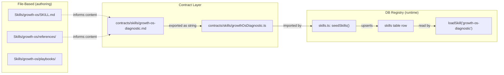

# Skills Architecture — Two Systems, One Loop

Pikar AI has **two skill systems** that serve different roles. Understanding when to touch which is essential before modifying agent behaviour.

## 1. The DB Skill Registry (runtime — what the agent executes)

**Location:** `skills` and `tenantSkills` tables in [`schema.ts`](../../packages/backend/convex/schema.ts)
**Adapter:** [`packages/backend/convex/skills.ts`](../../packages/backend/convex/skills.ts)
**Contract:** [`packages/contracts/src/skill.ts`](../../packages/contracts/src/skill.ts)

Every agent prompt is a **versioned row** in the `skills` table, loaded at runtime by `loadSkill("executive-router")`. Prompts are never hardcoded in source (CLAUDE.md §5).

### How it works

| Table | Scope | Purpose |
|-------|-------|---------|
| `skills` | Deployment-global | The canonical prompt for each agent role. Seeded by `skills:seedSkills` |
| `tenantSkills` | Per-tenant overlay | User/agent customisations composed on top of the global base |

### Lifecycle

1. **Seed** — `pnpm dev` auto-runs `seedSkills` on every push. For production: `pnpm --filter @pikar/backend seed`
2. **Version** — A prompt change is a new version row + an `activateSkill` status flip. Body/name/version are immutable once inserted.
3. **Override** — A tenant can author a `tenantSkills` candidate (composed body = base + adaptation). It must pass eval evidence before the owner can activate it.
4. **Rollback** — System baselines are `rollbackEligible: true`, giving every tenant a safe fallback.

### Prompt bodies live in `packages/contracts/skills/`

Each `.md` file (e.g., `cockpit-agent.md`) is the source-of-truth for a prompt body. A corresponding `.ts` file exports it as a string constant. The seed function reads these constants and writes them to the `skills` table.

**30 skill definitions** are currently registered, including:
`executive-router`, `cockpit-agent`, `email-drafter`, `content-drafter`, `document-drafter`,
`research-specialist`, `media-director`, `business-profile`, `onboarding-agent`,
`growth-os-diagnostic`, `offer-architect`, `money-model-designer`, `lead-engine`, and more.

---

## 2. The File-Based Skills Suite (authoring — knowledge the agent draws from)

**Location:** [`Skills/`](../) at the repo root
**Skills:** `growth-os`, `offer-architect`, `money-model-designer`, `lead-engine`

These are **agent skill definitions** — structured knowledge, playbooks, reference material, scripts, and templates that agents and humans use to build and improve the DB entries. They are the *authoring-time* system.

### Structure of each skill

```
<skill>/
  SKILL.md      # When to use, routing triggers, playbook index
  references/   # Framework knowledge (loaded on demand)
  playbooks/    # Numbered step-by-step procedures, each ends in an artifact
  scripts/      # Python 3 (stdlib only) calculators: --help, JSON output, --stdin
  assets/       # Fill-in templates (canvases, scorecards)
```

### What they do NOT do

- They do **not** run at runtime inside the Convex backend
- They are **not** loaded by `loadSkill()` — the DB registry handles that
- They are **not** versioned in the `skills` table

### What they DO do

- Provide the **intellectual framework** that informs what goes into a prompt body
- Offer **executable playbooks** that an agent can follow step by step
- Supply **calculators** (Python scripts) for domain math (CFA, LTV:CAC, continuity pricing)
- Feed into the **Growth OS diagnostic loop**: diagnose → prescribe → execute → measure → re-diagnose

---

## The Bridge — How File Skills Become DB Skills



1. A human or agent reads the file-based skill's references and playbooks
2. That knowledge informs the **prompt body** written as a `.md` file in `packages/contracts/skills/`
3. The `.md` is exported as a TypeScript string constant
4. `seedSkills()` writes it to the `skills` table as a versioned row
5. At runtime, `loadSkill()` reads the active row and hands it to the agent

---

## When to Use Which

| Task | System | What to touch |
|------|--------|--------------|
| **Add a new agent capability** | Both | 1. Create file-based skill in `Skills/` (if framework-heavy) → 2. Write prompt body in `contracts/skills/` → 3. Register in `seedSkills()` |
| **Tune an existing agent prompt** | DB only | Edit the `.md` in `contracts/skills/`, bump the seed version |
| **Per-tenant prompt customisation** | DB only | `tenantSkills` overlay via the owner dashboard |
| **Add a new business calculator** | File only | Add a Python script to the relevant `Skills/<skill>/scripts/` |
| **Update framework knowledge** | File only | Edit `Skills/<skill>/references/` |
| **Add a new playbook** | File only | Add to `Skills/<skill>/playbooks/`, update `SKILL.md` index |
